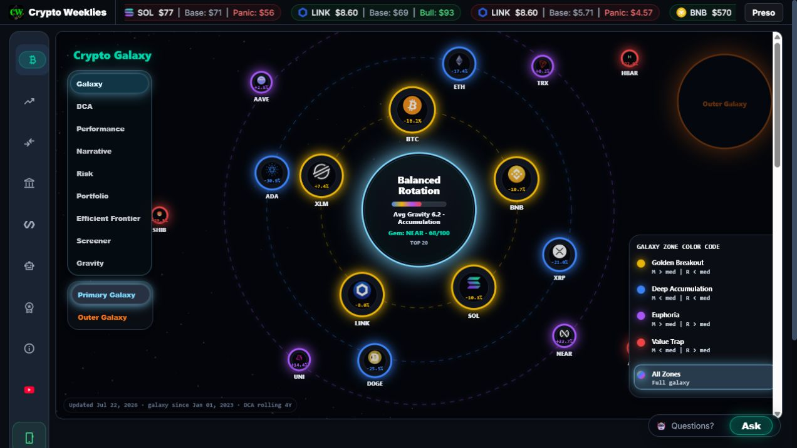
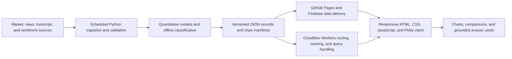

# CryptoWeeklies

**A production multi-asset decision-intelligence platform combining quantitative finance, grounded AI retrieval, automated data pipelines, and serverless web delivery.**

[Explore the live product](https://cryptoweeklies.com) | [View the research](https://scholar.google.com/citations?user=74xa2moAAAAJ) | [Connect with Himanshu Joshi](https://www.linkedin.com/in/hjoshi1)

> This repository is the public technical case study for CryptoWeeklies. It documents the product, architecture, engineering decisions, and selected non-proprietary demonstrations. Production source code, quantitative-model implementations, deployment configuration, and credentials remain private.

## Why I built it

Financial information is abundant, but decision-ready analysis is often fragmented across charting tools, research feeds, spreadsheets, and generic AI assistants. CryptoWeeklies consolidates those workflows into a free public product that helps users explore risk, valuation, market regimes, and long-horizon scenarios without a subscription or sponsored-token model.

I conceived, designed, engineered, and operate the platform end to end: financial-model design, data ingestion, AI and retrieval workflows, backend services, frontend interaction design, cloud deployment, automation, monitoring, and product iteration.

## What the product does

- Serves quantitative analysis for cryptocurrencies, crypto pairs, Bitcoin-related equities, AI-infrastructure companies, quantum-computing companies, ETFs, and broad-market proxies.
- Produces interpretable views for TWAP and gravity risk, SMA/DCA strategies, regression-derived fair-value bands, market phases, forecast ranges, long-horizon CAGR scenarios, portfolio comparisons, and opportunity-cost analysis.
- Publishes a large library of per-asset reports and structured records through scheduled Python workflows.
- Converts natural-language questions into chart-grounded answer cards backed by the site's versioned data inventory.
- Delivers a responsive browser and mobile experience using HTML, CSS, JavaScript, and Plotly.

The live terminal provides searchable coverage across crypto, AI stocks, quantum stocks, Bitcoin equities, and ETFs: [cryptoweeklies.com](https://cryptoweeklies.com).

## Product preview

*Live Crypto Galaxy interface. Select the image to open the production product.*

## Architecture at a glance

### Data and quantitative layer

- Scheduled Python pipelines acquire, normalize, validate, and publish market and contextual data.
- Financial logic calculates risk measures, strategy views, valuation bands, market-regime indicators, and scenario outputs.
- Data products are materialized as versioned structured records and chart manifests so that published results are reproducible and traceable.

### Grounded AI and retrieval layer

- Queries are classified and resolved against a controlled inventory of assets, aliases, charts, and structured evidence.
- Quantitative outputs are computed before retrieval; the answer experience retrieves evidence rather than asking an LLM to invent calculations at runtime.
- Numeric claims remain tied to a specific chart or data artifact.
- Unsupported requests return an explicit unavailable-data state instead of an ungrounded answer.
- Edge caching, constrained routing, and selective offline model use reduce runtime cost and rate-limit exposure.

This design deliberately favors deterministic retrieval for high-stakes numerical content. It reduces hallucination risk while preserving a conversational path from a user's question to the underlying evidence.

### Product and delivery layer

- Vanilla HTML, CSS, JavaScript, and Plotly support a responsive, low-dependency user experience.
- Cloudflare Workers provide edge routing, caching, CORS handling, and request controls.
- GitHub Actions and Cloud Run-oriented jobs automate data refresh and publishing workflows.
- GitHub Pages and Firebase support delivery of versioned artifacts and application data.

## Selected engineering decisions

| Decision | Reason | Product effect |
| --- | --- | --- |
| Precompute quantitative artifacts | Separate financial calculations from user-facing retrieval | Consistent answers and auditable model outputs |
| Use versioned manifests and records | Preserve a stable evidence layer | Traceable numeric claims and safer updates |
| Resolve known assets and aliases deterministically | Avoid unnecessary free-form generation | Faster, more predictable query handling |
| Return explicit missing-data states | Do not manufacture unsupported analysis | Clear failure behavior and greater user trust |
| Cache at the edge | Minimize repeated origin and model calls | Low marginal serving cost for a free public product |
| Keep the browser client lightweight | Reduce operational complexity | Responsive access across desktop and mobile |

## System scope

| Area | Selected capabilities |
| --- | --- |
| Quantitative finance | TWAP, gravity risk, SMA/DCA, regression bands, market phases, forecast ranges, CAGR scenarios, pair and portfolio analytics |
| Applied AI | Structured retrieval, NLP classification, chart-grounded responses, sentiment analysis, explicit fallback handling |
| Data engineering | Python ETL, scheduled refreshes, validation, structured JSON, versioned manifests, multi-source ingestion |
| Backend and cloud | Cloudflare Workers, Firebase, GitHub Actions, GitHub Pages, Cloud Run-oriented jobs, caching and request controls |
| Frontend and visualization | HTML, CSS, JavaScript, Plotly, responsive interaction design, searchable report library |
| Product ownership | Research, requirements, financial logic, architecture, implementation, deployment, monitoring, and iteration |

## Research foundation

CryptoWeeklies also provides an applied setting for my research into AI-assisted financial decision-making, market efficiency, grounded information systems, and responsible NLP. I am first author on four peer-reviewed publications from 2025:

1. **"AI, EMH and Behavioral Finance."** Springer, pp. 22-31.
2. **"Developing Natural Language Processing Algorithms to Fact-Check Speech or Text."** *Procedia Computer Science*, vol. 258, pp. 2343-2351, Elsevier.
3. **"Multimodal Learning in Natural Language Processing: Fact-Checking, Ethics and Misinformation Detection."** IEEE ICMSCI.
4. **"Ethics in Natural Language Processing: Addressing Bias, Privacy, and Misinformation."** IEEE ICPCT.

See the complete publication record on [Google Scholar](https://scholar.google.com/citations?user=74xa2moAAAAJ).

## Repository boundary

This public repository is intentionally documentation-led. It may contain selected notebooks, examples, diagrams, and sanitized demonstrations that explain the system without disclosing proprietary financial logic or production secrets.

Not published here:

- Proprietary quantitative-model implementations and parameters
- Production application source and infrastructure configuration
- Credentials, private endpoints, or operational data
- Internal evaluation, monitoring, and deployment artifacts

Private architecture and code walkthroughs can be provided during a legitimate technical interview when appropriate.

## Creator

CryptoWeeklies is an independent product created and operated by **Himanshu Joshi**, a data and AI practitioner with a Doctor of Business Administration in Business Intelligence and Data Analytics, an MBA in Finance, an MS in Information Systems, and a BE in Computer Science.

- Product: [https://cryptoweeklies.com](https://cryptoweeklies.com)
- LinkedIn: [https://www.linkedin.com/in/hjoshi1](https://www.linkedin.com/in/hjoshi1)
- Research: [https://scholar.google.com/citations?user=74xa2moAAAAJ](https://scholar.google.com/citations?user=74xa2moAAAAJ)

## Disclaimer

CryptoWeeklies is an educational and research product. Nothing on the platform constitutes financial, investment, legal, or tax advice. Forecasts and model outputs are uncertain, and past performance does not guarantee future results.
